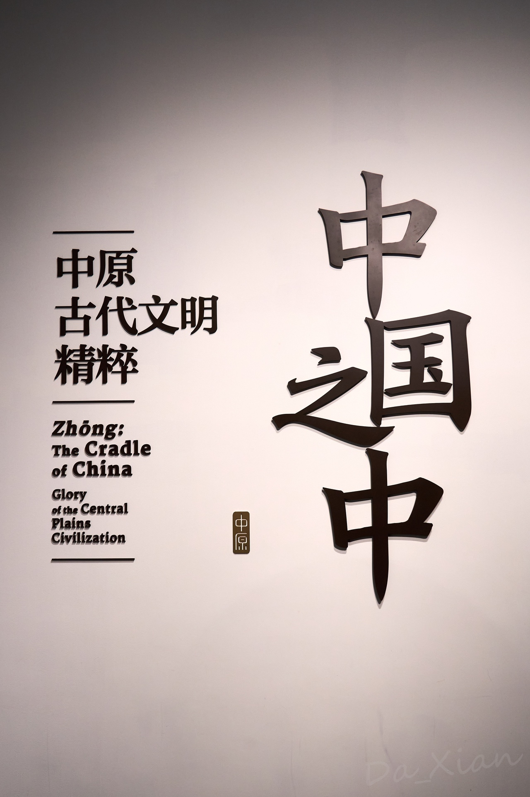

# 清艺博——中国之中：中原古代文明精粹之一

中原地区是华夏文明的发源地。在这片土地上，考古工作者发掘出一批批珍贵的历史遗存，串联起从史前到历史时期的发展脉络。本系列以清华大学艺术博物馆藏品为线索，梳理中原古代文明的重要物证。

本篇聚焦**裴李岗文化**（约公元前 6700–前 4800 年）早期遗存，主要出土于河南舞阳贾湖遗址与长葛石固遗址。这些器物涵盖音乐（骨笛）、宗教信仰（龟甲、骨器）、装饰艺术（绿松石饰、玉璜）、工艺技术（石环）及日常生活（陶鼎、陶瓶）等多个维度，呈现出八千年前中原先民丰富而精致的精神与物质世界。

---

## 刻纹骨笛

Carved bone flute

裴李岗文化，约公元前 6700–前 4800 年

长（L.）18 cm

骨（Bone）

舞阳贾湖遗址出土

Unearthed from the Jiahu site, Wuyang

贾湖遗址博物馆 Jiahu Ruins Museum

贾湖遗址目前出土了 40 余支骨笛，均使用丹顶鹤尺骨所制，是迄今发现中国最早的吹奏乐器。其中七孔骨笛能吹奏七声音阶。这件笛身刻有复杂规整的几何纹饰，以连续的三角与菱形纹为主体，间以网状直线，构成富有节奏感的神秘图案。这些纹饰并非随意刻画，很可能具有某种宗教或仪式意义，是研究中国音乐起源与史前精神世界的重要实物。

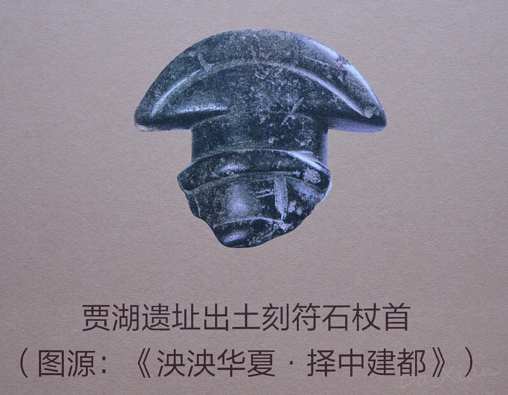
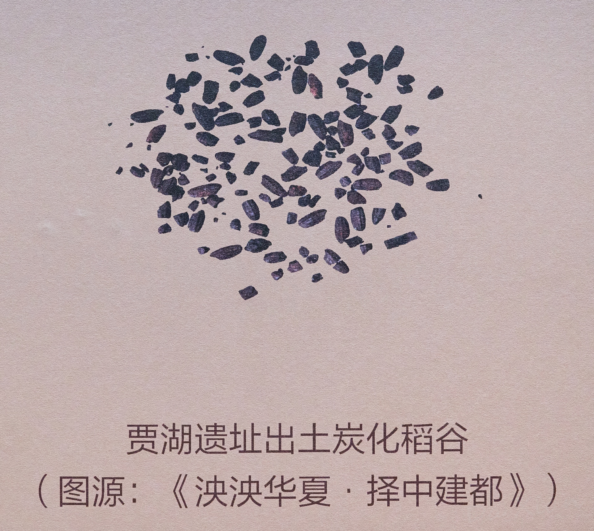
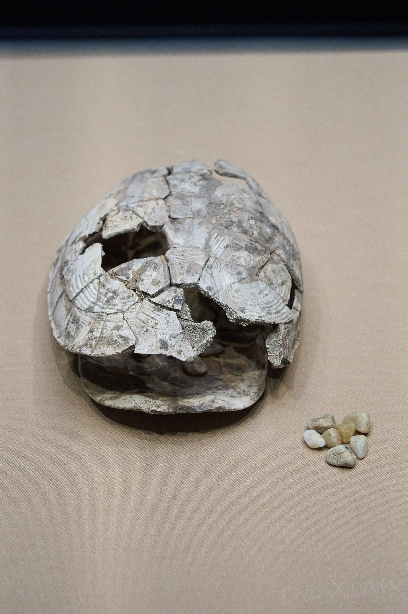
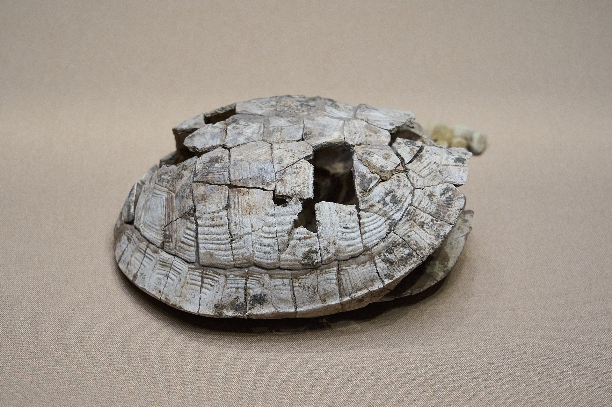
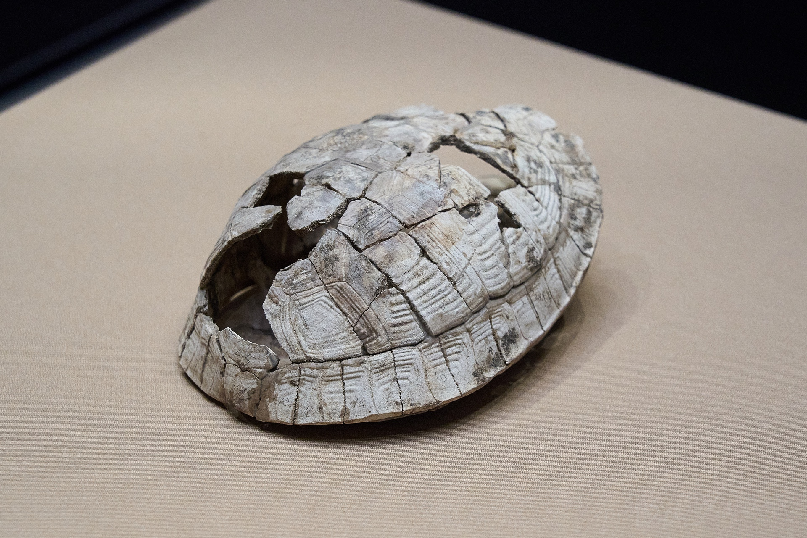
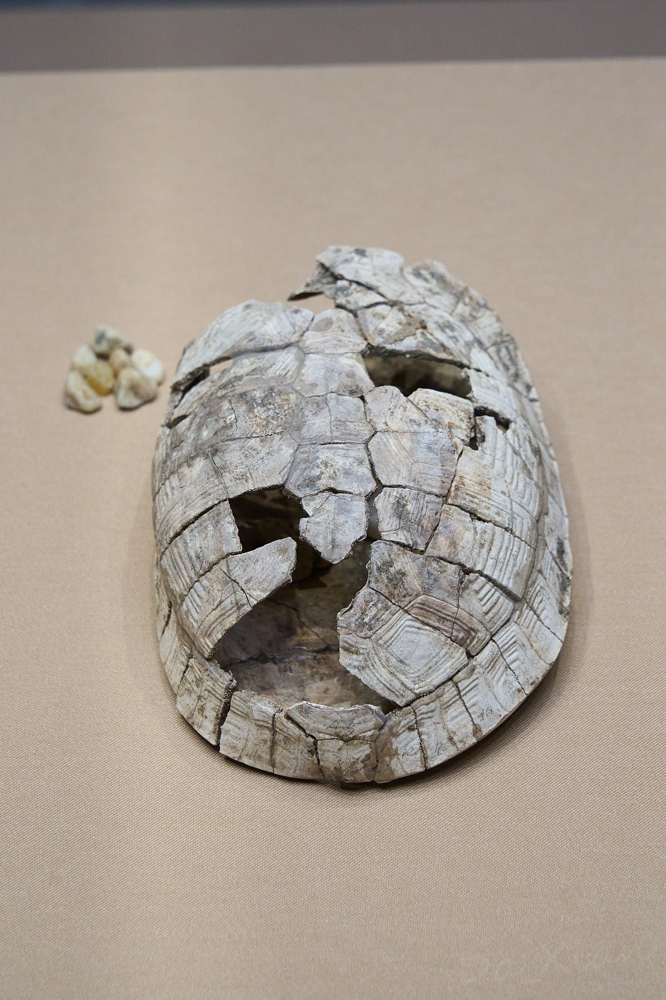
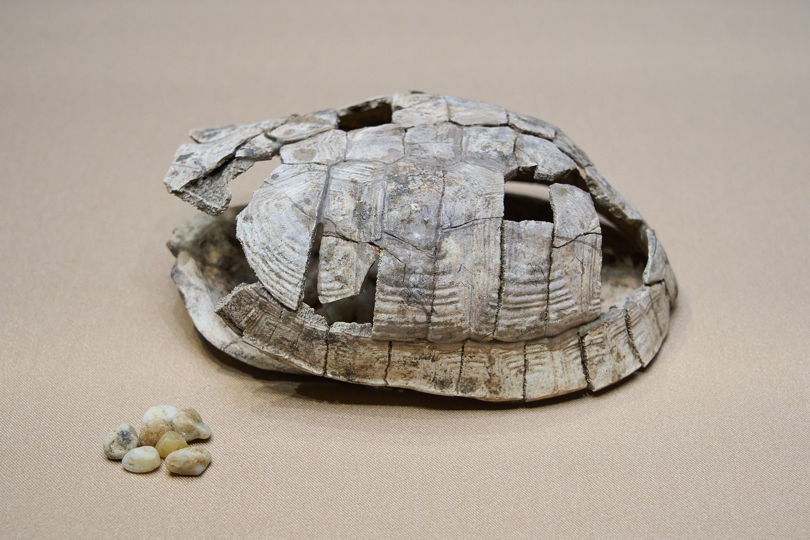

---

## 龟甲

Tortoise carapaces

裴李岗文化，约公元前 6700–前 4800 年

高（H.）12 cm 长（L.）16 cm

宽（W.）10 cm

骨、石子（Bone, stone）

舞阳贾湖遗址出土

Unearthed from the Jiahu site, Wuyang

贾湖遗址博物馆

贾湖遗址出土的龟甲，局部经人工打磨，因长期持握而呈现温润光泽。甲腔内装有石子，摇动时可发出声响，应是在仪式中使用的响器，也可能作为与鬼神沟通的媒介。贾湖人可能视龟为通灵之物，龟甲内放置的石子，或用于数卜等原始占卜行为，体现出先民试图通过物象与超自然力量建立联系的原始宗教观念。

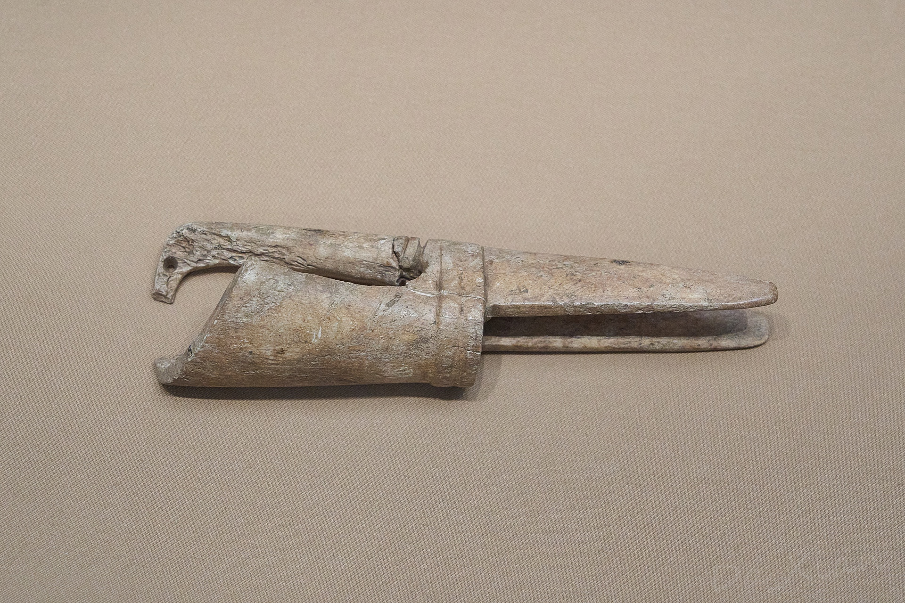
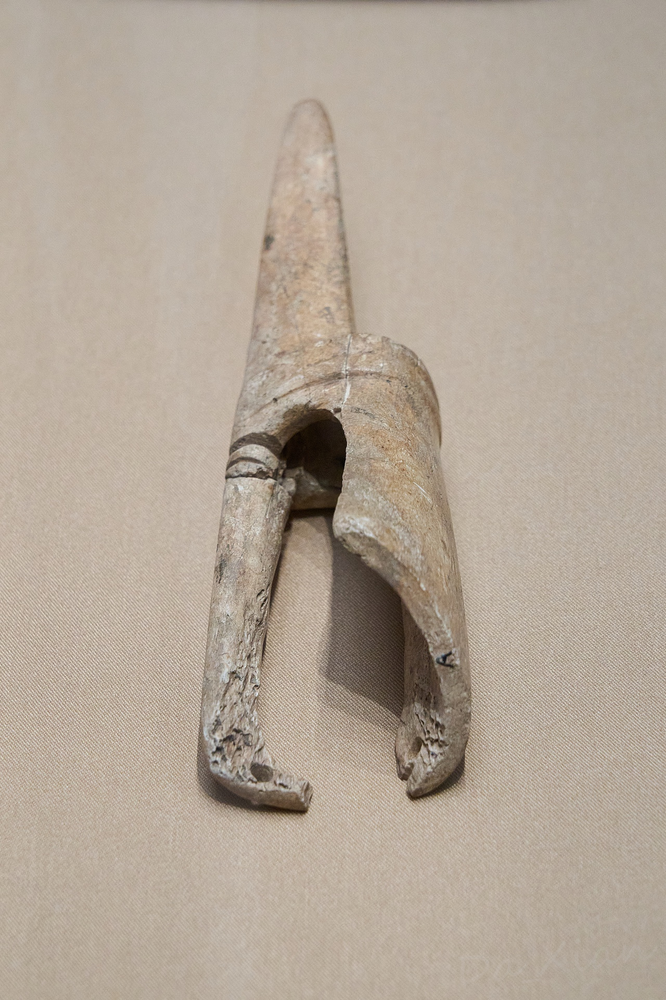

---

## 叉形骨器

Pitchfork-shaped bone artifact

裴李岗文化，约公元前 6700–前 4800 年

高（H.）23.8 cm 宽（W.）5.9 cm

厚（Thk.）5.5 cm

骨（Bone）

舞阳贾湖遗址出土

Unearthed from the Jiahu site, Wuyang

贾湖遗址博物馆

器身可见多次残断后缀合痕迹，中部有两对缀合孔。

器面浅刻符号，推测应与原始宗教相关，或为祭祀占卜道具。其叉形形制独特，目前在同类文化遗存中尚属罕见，对于理解裴李岗时期宗教实践的具体形态提供了珍贵的实物线索。

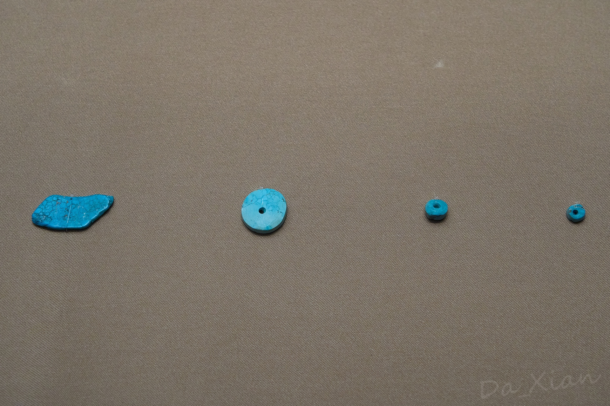
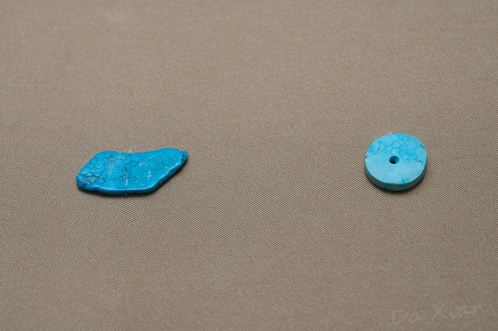

---

## 绿松石饰

Turquoise ornaments

裴李岗文化，约公元前 6700–前 4800 年

方形坠饰（Rectangular pendant）

长（L.）3.61 cm 宽（W.）1.675 cm 厚（Thk.）0.315 cm 孔径（Aperture）0.222 cm

圆形饰（Circular ornament）

长（L.）2.138–0.858 cm 厚（Thk.）0.482–0.413 cm 孔径（Aperture）0.253–0.217 cm

绿松石（Turquoise）

舞阳贾湖遗址出土

Unearthed from the Jiahu site, Wuyang

贾湖遗址博物馆

贾湖遗址出土的绿松石饰，多见置于墓主人的耳畔与颈项之间，形制丰富，包括圆形、方形、三角形及不规则形状等多种样式。这些饰物均经过精细的打磨与抛光，表面光滑润泽，部分材质薄透莹亮，是中国境内迄今发现年代最早的绿松石装饰品。遗址中出土绿松石总数逾百件，反映出彼时先民已具备相当水平的玉石加工技术与审美意识。

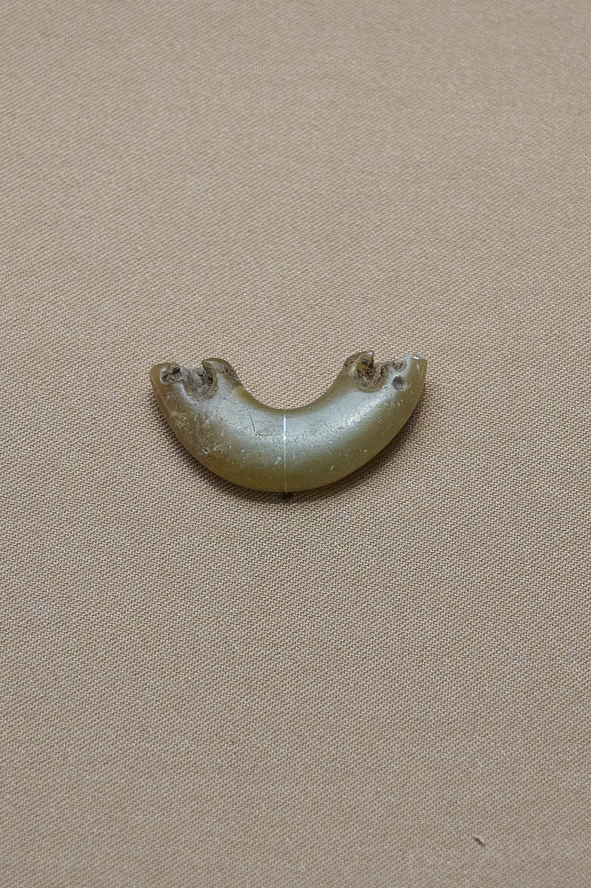
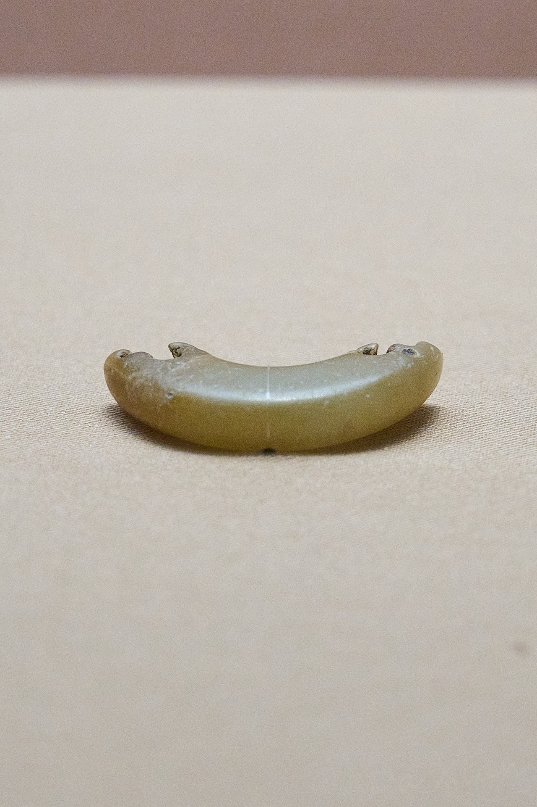

---

## 玉璜

Jade huang pendant

裴李岗文化，约公元前 6700–前 4800 年

长（L.）3.2 cm 宽（W.）1.1 cm

玉（Jade）

舞阳贾湖遗址出土

Unearthed from the Jiahu site, Wuyang

贾湖遗址博物馆

此件玉璜器表温润，可见自然沁斑与打磨光泽，形制简朴而边缘圆整，展现了新石器时代早期玉器制作的初始形态。贾湖遗址所出土的玉器，是中原地区迄今发现年代最早的玉器之一，标志着先民在长期石器制作过程中，已逐渐识别出"玉"不同于一般石料的独特质感与美感，并开始有意识地加以开发和利用。

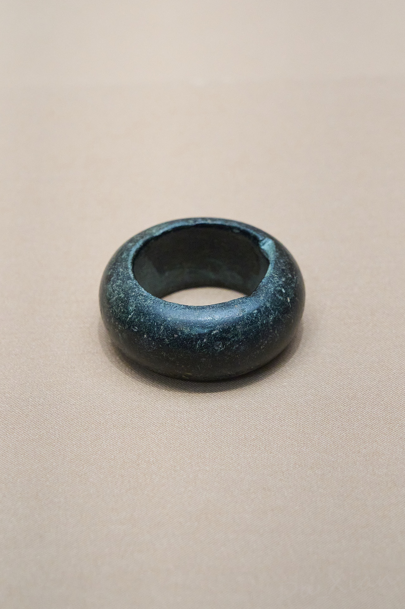
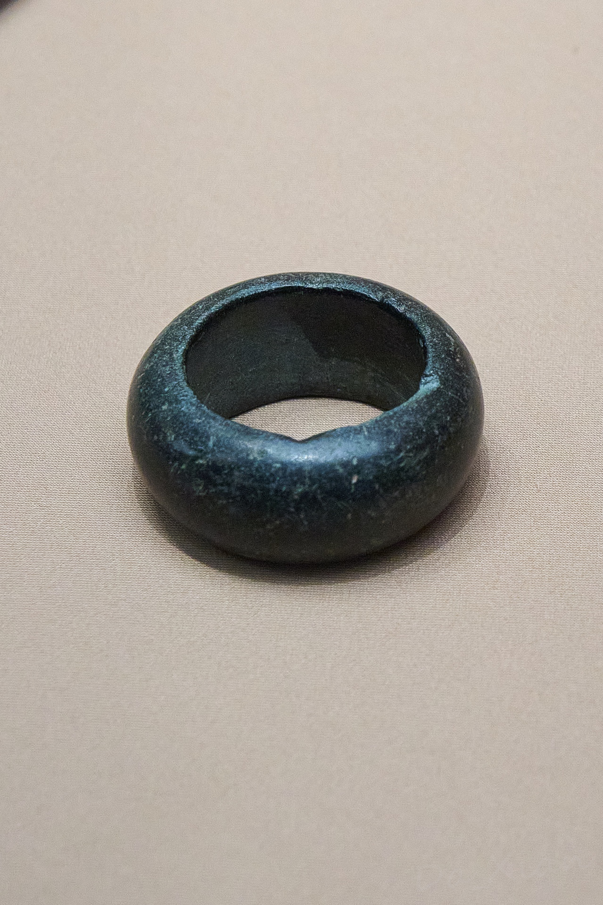

---

## 石环

Stone ring

裴李岗文化，约公元前 6700–前 4800 年

外径（Outer diam.）6.4 cm

内径（Inner diam.）4.1 cm

厚（Thk.）2.6 cm

石（Stone）

舞阳贾湖遗址出土

Unearthed from the Jiahu site, Wuyang

贾湖遗址博物馆

此石环体量浑厚，中间对钻规整圆孔，孔壁竖直，环体中部微向外凸，造型匀整。规整的钻孔与匀称的轮廓，反映出贾湖先民在石器加工方面已具备较高的技术水平与审美追求。此类石环在当时可能兼具实用与装饰功能，是研究裴李岗文化时期工艺发展与社会生活的重要实证。

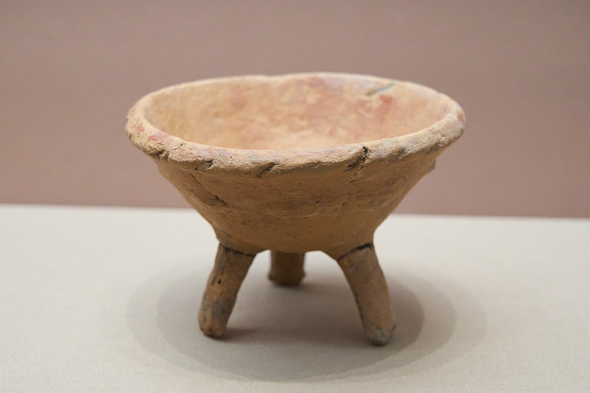
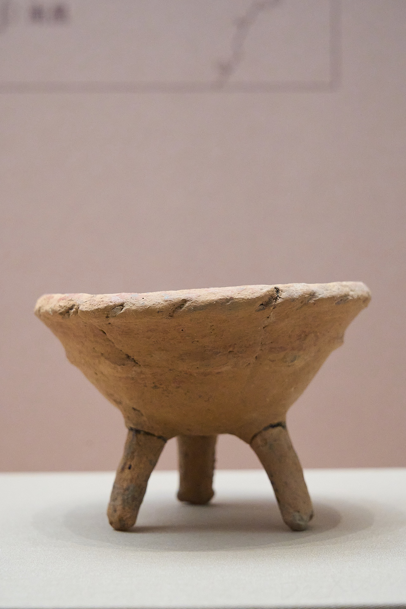
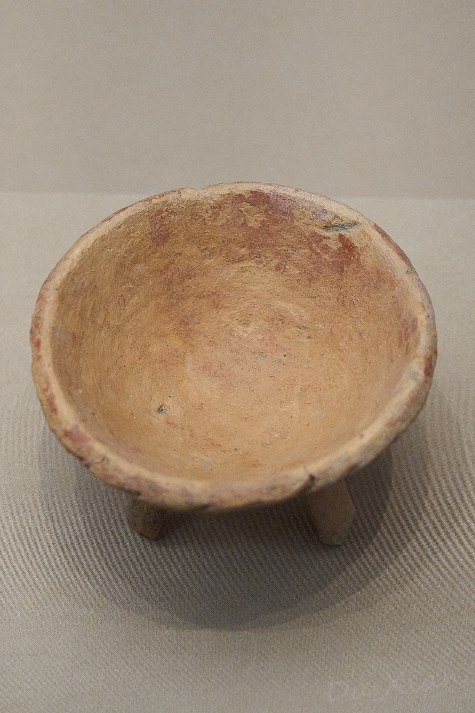

---

## 陶鼎

Pottery ding tripod cauldron

裴李岗文化，约公元前 6700–前 4800 年

口径（Diam. of mouth）18.4 cm

壁厚（Thk. of wall）1.0 cm

腹径（Diam. of body）15.66 cm

腹深（D. of body）7.8 cm

通高（Overall H.）10.8 cm

陶器（Earthenware）

舞阳贾湖遗址出土

Unearthed from the Jiahu site, Wuyang

贾湖遗址博物馆

鼎身呈平底盆形，下承三足，足跟微向外撇，造型稳重质朴。作为新石器时代早期的典型炊煮器，其陶胎厚实耐烧，三足设计便于架火加热，体现了先民在日常生活实践中的工艺智慧。贾湖遗址出土了包括罐形、盆形、钵形等多种形制的陶鼎，是目前中国境内发现年代最早的陶鼎之一，为研究中国古代礼器制度的起源提供了重要线索。

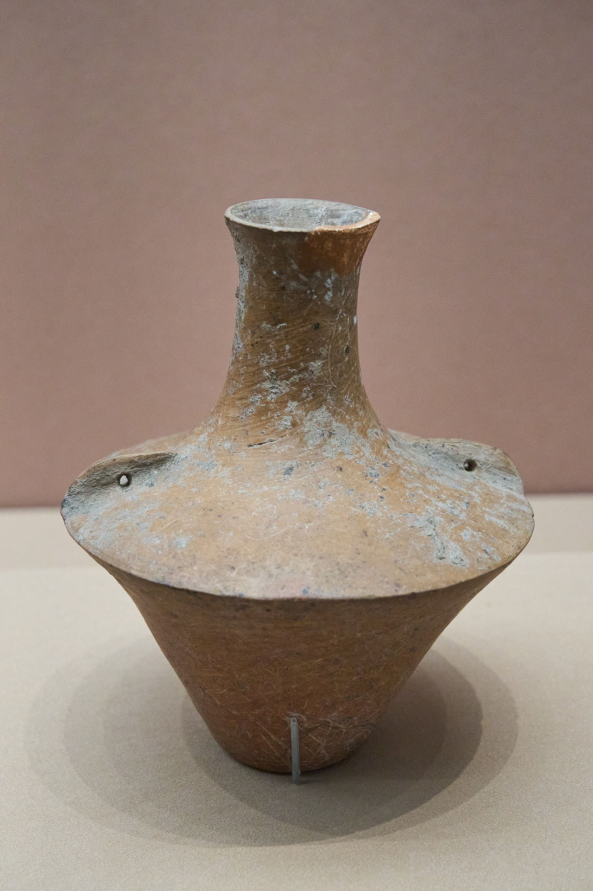
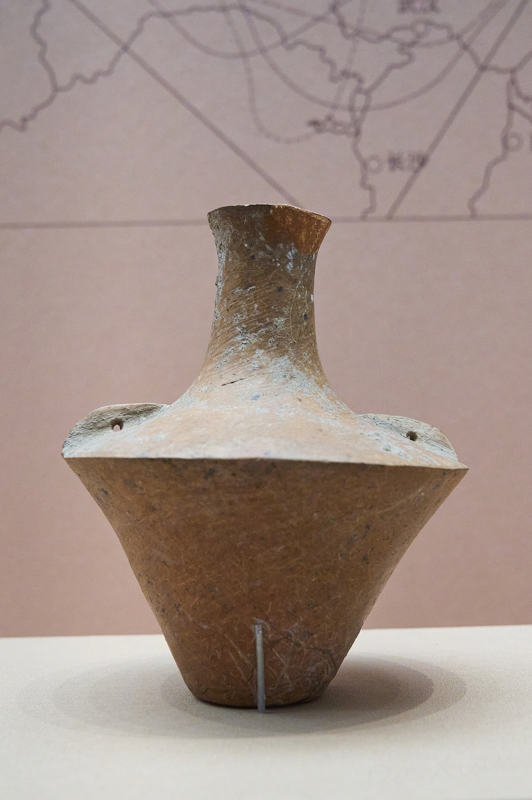
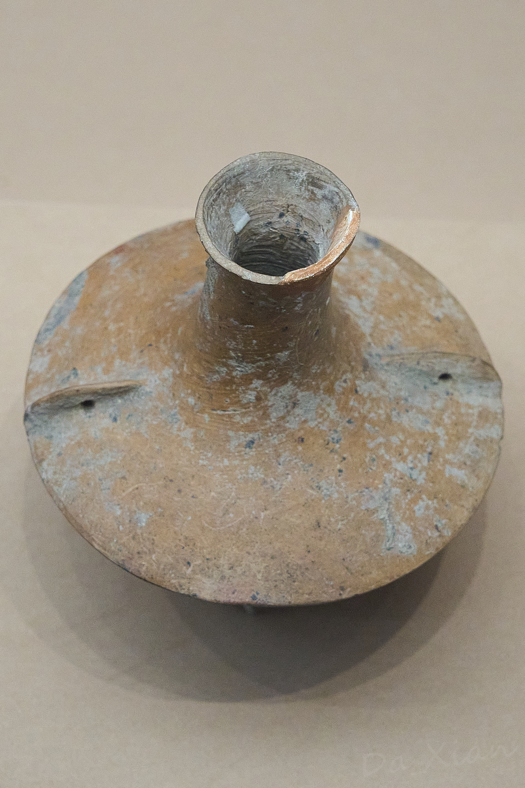

---

## 陶瓶

Pottery bottle

裴李岗文化，约公元前 6700–前 4800 年

通高（Overall H.）17.6 cm

口径（Diam. of mouth）4.6 cm

底径（Diam. of bottom）4.8 cm

陶（Pottery）

长葛石固遗址出土

Unearthed from the Shigu site, Changge

河南省文物考古研究院

Henan Provincial Institute of Cultural Relics and Archaeology

此陶瓶为裴李岗文化典型器物，侈口、细长颈、急折肩，平底，造型简朴而匀称。肩部对称附有扉棱状耳，其上穿孔，应可供穿系提携。器表经磨光处理，素面无纹，呈现陶土原色与温和光泽。同类器型亦见于舞阳贾湖遗址，反映出裴李岗文化陶器在造型与工艺上的共同特征，也说明当时各遗址之间可能存在广泛的交流与联系。

---

*本文图片与文物信息整理自清华大学艺术博物馆"中国之中"展览资料。*
